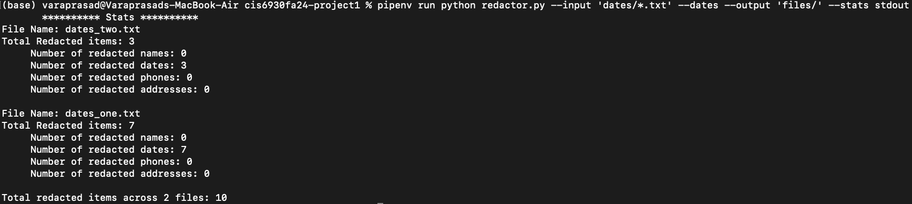
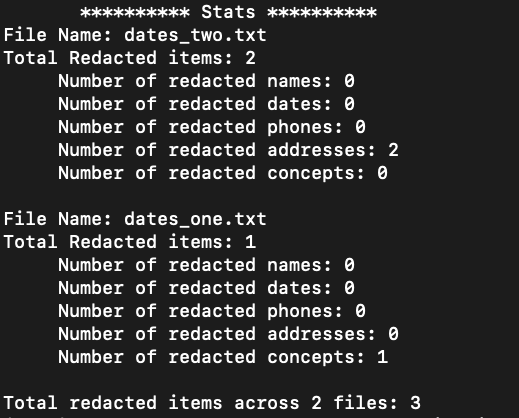

# The Redactor

## CIS6930 Fall 24 Project 1

## Name : Chenna Kesava Varaprasad Korlapati

## Project Description 

In this project, I have created a Python package to censor sensitive data in plain text files. For this, I have created a
custom Spacy Pipeline to perform redaction of different types of data like names, dates, phones and addresses. I have also implemented 
concept flag that allows to redact information related to specific theme. I have also provided stats
with the number of items redacted by type for each file and the overall number of items redacted in the process.

## Pre Requisites
`Python >= 3.7` and `pip` should be installed already before the start of installation.

## Setting Up The Project

### Installation

Once we have `python3` and `pip`, `pipenv` can be installed using below command
~~~
pip install pipenv
~~~

For this project, we need the following python packages to be installed which were listed in `Pipfile`.
* `pytest` 
* `pypdf`
* `pytest-runner`
* `spacy`
* `en_core_web_trf`

The requirements can be installed by running the following command from the project's root directory.

~~~
pipenv install
~~~

All the packages listed in `Pipfile` will be installed and `Pipfile.lock` (which contains versions of packages installed)
will be generated.

### Folder Structure
Folders `names`, `dates`, `phones`, `address` are used to store input files for the censor flags.

Folder `concept` is used to store input files for concepts.

Folder `tests` contains pytest test files.

Folder `img` contain images used in README.md file

Folder `files` is used to store output redacted files used for sample testing.

### To Run The Code

Once all the required packages are installed, change the current directory to project's root directory and run the `redactor.py` file with `pipenv` using the below commands.
* To display the nature of incidents and the number of times they have occurred on a single day. Argument `incidents` is required.
  ~~~
  pipenv run python redactor.py --input <input_files_pattern> --names --dates --phones --address\
                    --concept <theme_name> --output <output_files_dir> --stats <stats_file_name>
  ~~~
  Example : To run the code with some example parameters
  ~~~
  pipenv run python redactor.py --input 'dates/*.txt' --dates --output 'files/' --stats stdout
  ~~~

  Output after running the above example command.
  
  

Since stdout is given as filename for writing --stats, stats are displayed on the terminal.
Output files will be saved in the `files/` directory with `.censored` extension.

### To Run the Tests
Run the following command from project's root directory to run the testcases from `tests/` folder.
~~~
pipenv run python -m pytest -v
~~~

## Overview of Functions and Testcases

For redaction process, I have implemented custom components for redacting different types of data. I have created
four custom components `redact_names, redact_dates, redact_phones, redact_address` which redact `names, dates, phones, addresses`
respectively in the doc. I have also implemented `redact_concepts` function which redacts sentences in the text that are related to
any keyword (and its synonyms) in the `concepts` list.

The `stats` include number of items redacted for each censor flag type at file level, and total number of redacted items
across all files.

A Sample Stats written to stdout is attached below:
  

### Functions
The `redactor.py` contain all the functions implemented for this project. Here is the description of each function.

* #### main(input, censor_flags, concept, output, write_stats_to)
  This function accept `input`, `censor_flags`, `concept`, `output`, `write_stats_to` as parameters, then fetch all the files matching `input` patterns, 
  process these files in order, then get the `all_stats` and write these stats to the `write_stats_to` location.
  
  Here
    * `input` is list of file patterns to identify list of files to be processed
    * `censor_flags` is a list of censor flags that need to be identified and redacted
    * `concept` is a list of ideas that need to be identified and redacted
    * `output` is the directory path to store the redacted files
    * `write_stats_to` is the file location to write the stats. (Includes special files - stdout, stderr)

* #### write_all_stats(all_stats, write_stats_to)
  This function takes `all_stats` dictionary, `write_stats_to`, generate the stats string from `all_stats` and write the stats
  to the file location `write_stats_to`.

* #### get_files(input)
  This function accept `input` which is a list of input file patterns. These patterns are used by glob to get all the files with that pattern.
  This function return list of all files matching the input file patterns.

* #### read_file(file_name)
  This function accept `file_name`, reads content of the file and returns it as string.

* #### redaction(txt, censor_flags, concept)
  This function accept `txt` and process it according to `censor_flags`, `concept`. Based on the flags in censor_flags, the corresponding
  components are added to the pipeline for processing.
  This function return redacted text along with file stats.

* #### process_files(files, censor_flags, concept, output_dir)
  This function process all the `files` in order according to the `censor_flags`, `concept` and writes the redacted files to `output_dir`.
  This function return `all_stats` dictionary which contain stats of all files.
* #### redact_email(email, split_names)
  This function accept `email`, `split_names` as parameters, redacts any names part of `split_names` within username of `email` and return redacted email along with redacted items count.

* #### redact_text(text, split_names)
  This function accept `text`, `split_names` as parameters, redacts any names part of `split_names` within `text` and return redacted text along with redacted items count.

* #### redact_names(doc)
  This function is used as a component in spacy pipeline to redact names, which takes `doc` as input from previous component and redact names and generate new doc with redacted names.
  The core of this function is to use entities with label `PERSON` to identify names and possible split combinations of these names to match any other names left unredacted in the text.
  Email addresses username of type `firstname.lastname` are also redacted.
  This function performs redaction of names and returns a new `doc` with redacted names.
 
* #### redact_dates(doc)
  This function is used as a component in spacy pipeline to redact dates, which takes `doc` as input from previous component and redact dates and generate new doc with redacted dates.
  The core of this function is to use entities with label `DATE` to identify dates and additional standard date matching regex to match any other dates left unredacted in the text.
  This function performs redaction of dates and returns a new `doc` with redacted dates.

* #### redact_phones(doc)
  This function is used as a component in spacy pipeline to redact phone numbers, which takes `doc` as input from previous component and redact phone numbers and generate new doc with redacted phone numbers.
  The core of this function is to identify phone numbers with standard phone numbers matching regex and redact them in the text.
  This function performs redaction of phone numbers and returns a new `doc` with redacted phone numbers.

* #### redact_address(doc)
  This function is used as a component in spacy pipeline to redact addresses, which takes `doc` as input from previous component and redact addresses and generate new doc with redacted addresses.
  The core of this function is to use two different address matching regex patterns to identify the addresses in the text.
  One pattern identifies multi line addresses while the other is to identify single line addresses.
  This function performs redaction of addresses and returns a new `doc` with redacted addresses.

* #### download_nltk_resources()
  This function is to download and install nltk data packages `punkt`, `wordnet`, `punkt_tab`.

* #### get_synonyms(word)
  This function takes input a word and return the synonyms of that word using NLTK's WordNet.
  It returns the synonyms as a set.

* #### redact_concepts(text, concepts)
  This function is used to redact sentences for each of the concept in the list `concepts`. For redaction, this function
  fetches the synonyms for each of the concept and then use these words to identify the sentences containing them.
  If any of these synonyms or the actual concept word is present in any sentence in the text, then the whole sentence is
  redacted. This function returns the `redacted text`, `redacted concepts count` after performing redaction for all concepts.
  
  Note: For redacting concepts, nltk sentence tokenizer is used to split text into sentences. If a sentence contains any concept related word,
  then whole sentence will be redacted. There is a chance that some of the cases might not be redacted as expected, due to word not identified as synonym
  or sentences not properly tokenized.

### Testcases
The `test_redactor.py` under `tests/` directory contain all the test functions implemented for this project. These tests cover the functions inside `redactor.py` file.
Here is the description of each test function.

* `test_redact_concepts()` This function tests the functionality of function `redact_concepts()`

* `test_get_synonyms()` This function tests the functionality of function `get_synonyms()`

* `test_download_nltk_resources()` This function tests the functionality of function `download_nltk_resources()`

* `test_redact_address()` This function tests the functionality of function `redact_address()`

* `test_redact_phones()` This function tests the functionality of function `redact_phones()`

* `test_redact_dates()` This function tests the functionality of function `redact_dates()`

* `test_redact_names()` This function tests the functionality of function `redact_names()`

* `test_process_files()` This function tests the functionality of function `process_files()`

* `test_redaction()` This function tests the functionality of function `redaction()`

* `test_read_file()` This function tests the functionality of function `read_file()`

* `test_get_files()` This function tests the functionality of function `get_files()`

* `test_write_all_stats()` This function tests the functionality of function `write_all_stats()`

* `test_main()` This function tests the functionality of function `main()`

## Bugs and Assumptions
Following are the assumptions made while working on this project:
* For redacting names, I have assumed that names are identified only through entity label `PERSON`.
* For redacting dates, I have assumed that dates are identified only through entity label `DATE`.

Following are the bugs identified:
* During the redaction of names, names that are combination of a name and some additional characters is not redacted in some cases as the model is not able to identify it nor the regex pattern.
* During the redaction of dates, spaces between month, date and year are not redacted. In some case, time along with date is redacted.
* During the redaction of phones, spaces if any within the phone number are not redacted.
* During the redaction of addresses, spaces if any within the address are not redacted in some cases.
